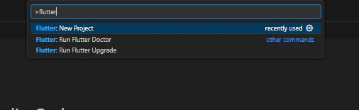
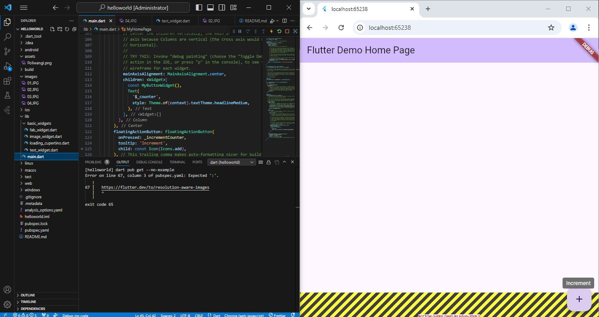

# helloworld

A new Flutter project.
 
Tugsa Praktikum Matakulai Pemrograman Perangkat Bergerak
 
Nama : Legar Suryantara
 
NIM : 362358302043
 
Kelas : 2D TRPL
 
praktikum 1

 
praktikum 2

Praktikum 2 ini fokus pada integrasi proyek Flutter dengan GitHub untuk manajemen versi kode. Pertama, kita diminta untuk membuat repository baru di GitHub dengan nama "flutter-fundamental-part1". Setelah itu, kita kembali ke Visual Studio Code, membuka terminal, dan menjalankan perintah git init untuk menginisialisasi Git di proyek Flutter kita. Kemudian, melalui menu Source Control, kita melakukan staging pada file .gitignore, memberikan pesan commit "tambah gitignore", dan melakukan push untuk mengunggah file tersebut ke repository GitHub. Selanjutnya, kita juga melakukan langkah serupa pada file README.md dengan menambahkan remote repository dan menggunakan personal access token untuk autentikasi saat melakukan push.
Setelah menyiapkan file awal, kita melanjutkan dengan menjalankan proyek Flutter hello_world di emulator atau browser, lalu mengambil screenshot dari aplikasi yang berjalan dengan menampilkan nama lengkap kita. Screenshot tersebut disimpan sebagai 01.png dalam folder images yang baru dibuat. Terakhir, kita mengubah isi README.md untuk menampilkan screenshot dan melakukan push kembali ke repository GitHub. Melalui praktikum ini, kita belajar bagaimana mengelola proyek Flutter menggunakan Git dan GitHub secara efektif, serta mendapatkan pengalaman dalam melakukan kompilasi dan menjalankan aplikasi Flutter.
 
praktikum 3

Pada langkah ini, saya membuat folder baru bernama basic_widgets di dalam folder lib. Setelah itu, saya membuat file baru bernama text_widget.dart di dalam folder basic_widgets. Di dalam file tersebut, saya menambahkan kode untuk membuat kelas MyTextWidget. Kelas ini menampilkan teks “Nama saya Fulan, sedang belajar Pemrograman Mobile” dengan warna merah dan ukuran font 14, serta teks berada di tengah. Dengan langkah-langkah ini, saya berhasil membuat dan menampilkan Text Widget sederhana di aplikasi Flutter saya.
 
Image Widget

Pada langkah ini, saya membuat file baru bernama image_widget.dart di dalam folder basic_widgets dengan isi kode yang menampilkan gambar menggunakan Image Widget. Setelah itu, saya melakukan penyesuaian pada file pubspec.yaml untuk menambahkan aset gambar dengan menambahkan baris yang mengarahkan ke file logo.jpg di dalam folder assets. Kemudian, saya memastikan file gambar logo.jpg berada di dalam folder assets di proyek hello_world saya. Dengan langkah-langkah ini, saya berhasil menampilkan gambar menggunakan Image Widget di aplikasi Flutter saya.
 
praktikum 4
Cupertino Button dan Loading Bar

Pada langkah ini, saya membuat file baru bernama loading_cupertino.dart di dalam folder basic_widgets. Saya mengimpor StatelessWidget dari paket material dan cupertino. Di dalam method Widget build, saya menambahkan kode untuk membuat aplikasi dengan MaterialApp yang memiliki sebuah Container dengan margin di bagian atas. Di dalam Container, saya menambahkan sebuah Column yang berisi CupertinoButton dengan teks “Contoh button” dan sebuah CupertinoActivityIndicator untuk menampilkan loading bar. Dengan langkah-langkah ini, saya berhasil membuat dan menampilkan sebuah tombol Cupertino dan loading bar di aplikasi Flutter saya.
 
Floating Action Button (FAB)

Pada langkah ini, saya membuat file baru bernama fab_widget.dart di dalam folder basic_widgets. Pertama, saya mengimpor StatelessWidget dari paket material. Setelah itu, saya menambahkan kode dalam metode Widget build yang mengembalikan MaterialApp dengan Scaffold. Di dalam Scaffold, saya menambahkan FloatingActionButton yang memiliki parameter onPressed untuk menentukan fungsi yang akan dijalankan saat tombol ditekan. Tombol ini menampilkan ikon jempol ke atas dan memiliki latar belakang berwarna merah muda. Dengan langkah ini, saya berhasil menambahkan elemen interaktif yang menarik ke dalam aplikasi Flutter, yang akan menjalankan kode di dalam blok onPressed setiap kali tombol ditekan.
 
Scaffold Widget

Pada langkah ini, kita menggunakan Scaffold widget di Flutter untuk mengatur tata letak aplikasi sesuai dengan prinsip Material Design. Scaffold menyediakan struktur dasar yang mencakup elemen-elemen seperti AppBar untuk menampilkan judul aplikasi, Body yang menggunakan Center dan Column untuk menampilkan teks serta nilai variabel _counter, dan FloatingActionButton yang berfungsi untuk menambah nilai tersebut setiap kali ditekan, dengan tampilan diperbarui menggunakan setState. Tombol ini ditempatkan di bagian bawah layar dengan posisi di tengah, sementara BottomAppBar berada di bagian bawah untuk elemen navigasi atau menu. Tema aplikasi diatur menggunakan warna dasar merah dengan ThemeData(primarySwatch: Colors.red), sehingga aplikasi memiliki tampilan yang konsisten dan mengikuti standar desain Flutter.
 
Dialog Widget

Pada langkah ini, kita menggunakan Dialog widget di Flutter, khususnya AlertDialog, untuk menampilkan pesan kepada pengguna. Dalam kode, kita mendefinisikan tombol ElevatedButton dengan teks "Show alert" yang ketika ditekan akan memanggil fungsi showAlertDialog(context) untuk menampilkan dialog. AlertDialog tersebut memiliki judul "My title", pesan "This is my message.", dan tombol OK yang ketika ditekan akan menutup dialog menggunakan Navigator.pop(context). Dialog ini memungkinkan kita menampilkan informasi atau notifikasi penting kepada pengguna dengan cara yang sederhana dan interaktif.
 
Input dan Selection Widget

ada langkah ini, kita menggunakan Input dan Selection Widget di Flutter, khususnya TextField, yang berfungsi untuk menerima input teks dari pengguna. Dalam contoh kode, widget TextField ditempatkan di dalam Scaffold yang memiliki AppBar dengan judul "Contoh TextField". Atribut obscureText diatur ke false, sehingga teks yang dimasukkan akan terlihat secara normal. Selain itu, TextField ini dilengkapi dengan dekorasi seperti labelText "Nama" dan OutlineInputBorder yang memberikan batas di sekitar kotak input. TextField merupakan widget penting yang sering digunakan untuk mendapatkan input dari pengguna dalam berbagai aplikasi.
 
Date and Time Pickers

Pada langkah ini, kita menggunakan Date and Time Pickers di Flutter untuk memungkinkan pengguna memilih tanggal. Dalam contoh kode, variabel selectedDate menyimpan tanggal yang dipilih, dan fungsi _selectDate digunakan untuk menampilkan DatePicker dengan menentukan tanggal awal, batas awal, dan batas akhir yang bisa dipilih. Ketika pengguna memilih tanggal, hasilnya disimpan dan diperbarui menggunakan setState, lalu ditampilkan di layar melalui widget Text. Tombol ElevatedButton dengan teks "Pilih Tanggal" berfungsi untuk memanggil DatePicker ini. Widget ini memudahkan pengguna dalam memilih tanggal melalui antarmuka yang intuitif dan interaktif.

## Getting Started

This project is a starting point for a Flutter application.

A few resources to get you started if this is your first Flutter project:

- [Lab: Write your first Flutter app](https://docs.flutter.dev/get-started/codelab)
- [Cookbook: Useful Flutter samples](https://docs.flutter.dev/cookbook)

For help getting started with Flutter development, view the
[online documentation](https://docs.flutter.dev/), which offers tutorials,
samples, guidance on mobile development, and a full API reference.
